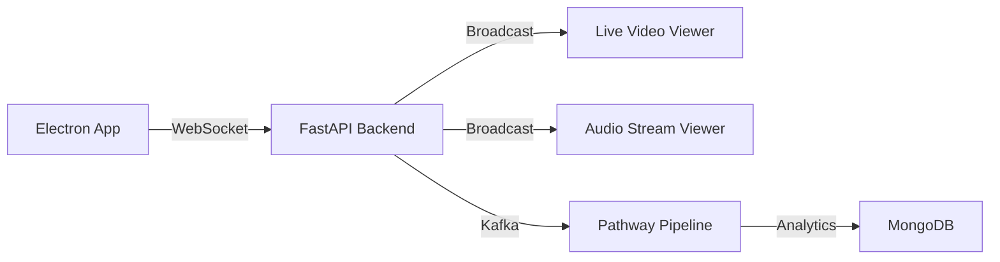

# VC Analyst Desktop App

## Overview
This repository contains a full‑stack desktop application built with **Electron**, **React (TypeScript)**, **FastAPI**, **MongoDB**, **Kafka**, and the **Pathway** streaming framework.  The app records screen, system audio, and microphone audio, streams the data in real‑time to a backend, and provides a detachable AI chat assistant.

---

## Table of Contents
1. [Prerequisites](#prerequisites)
2. [Project Structure](#project-structure)
3. [Setup Instructions](#setup-instructions)
   - [Backend (Python)](#backend-python)
   - [Frontend (Electron/React)](#frontend-electronreact)
   - [Kafka & MongoDB](#kafka-mongodb)
   - [Pathway Pipelines](#pathway-pipelines)
4. [Running the Application](#running-the-application)
5. [Production Build](#production-build)
6. [Troubleshooting](#troubleshooting)
7. [License](#license)

---

## Prerequisites
| Tool | Minimum Version | Install Command |
|------|------------------|-----------------|
| **Node.js** | 18.x | `choco install nodejs` (Windows) or download from nodejs.org |
| **npm** | 9.x (bundled with Node) | — |
| **Python** | 3.11 | `choco install python` or download from python.org |
| **pip** | 23.x | — |
| **Docker Desktop** (optional, for Kafka & MongoDB) | 4.x | https://www.docker.com/products/docker-desktop |
| **Kafka** (stand‑alone) | 3.x | See *Kafka & MongoDB* section below |
| **MongoDB** | 6.x | See *Kafka & MongoDB* section below |
| **Pathway** | latest (pip install) | `pip install -U pathway` |
| **Confluent‑Kafka Python client** | latest | `pip install confluent-kafka` |
| **Git** | any | `choco install git` |

> **Note**: All commands shown are for Windows PowerShell. Adjust for your shell if needed.

---

## Project Structure
```
Electron_v3/
├─ src/                     # Electron source (main & renderer)
│   ├─ main/                # Main process (screenRecorder.ts, preload.ts)
│   └─ renderer/            # React UI (components, pages, store)
├─ backend/                 # FastAPI backend
│   ├─ routers/             # API routes (stream, startups, calendar)
│   ├─ models.py            # Pydantic models
│   ├─ database.py          # MongoDB client wrapper
│   ├─ pathway_pipelines/   # Pathway streaming pipelines
│   └─ templates/           # Jinja2 HTML for live stream viewer
├─ docker-compose.yml       # Docker services (mongo, kafka, zookeeper)
├─ requirements.txt         # Python dependencies
└─ README.md                # **You are here**
```

---

## Setup Instructions
### Backend (Python)
1. **Create a virtual environment**
   ```powershell
   cd backend
   python -m venv .venv
   .\.venv\Scripts\Activate.ps1
   ```
2. **Install dependencies**
   ```powershell
   pip install -r requirements.txt
   ```
   The `requirements.txt` now contains:
   ```text
   fastapi
   uvicorn[standard]
   motor
   aiokafka
   python-multipart
   websockets
   jinja2
   pydantic
   confluent-kafka
   pathway
   ```
3. **Environment variables** (create a `.env` file in `backend/`)
   ```dotenv
   MONGODB_URL=mongodb://localhost:27017
   KAFKA_BOOTSTRAP_SERVERS=localhost:9092
   ```
4. **Run the FastAPI server**
   ```powershell
   uvicorn main:app --reload --port 8000
   ```
   The API will be reachable at `http://localhost:8000`.

### Frontend (Electron/React)
1. **Install Node dependencies**
   ```powershell
   cd ..\src   # project root where package.json lives
   npm install
   ```
2. **Start the Electron app in development mode**
   ```powershell
   npm run dev   # uses Vite under the hood (if configured) or electron .
   ```
   The UI will launch and automatically connect to the backend.

### Kafka & MongoDB
You can run both services via Docker Compose (recommended) or install them locally.
#### Docker Compose (quick start)
```powershell
docker compose up -d
```
This will start:
- **MongoDB** on `mongodb://localhost:27017`
- **Zookeeper** on `localhost:2181`
- **Kafka** on `localhost:9092`
#### Manual installation (optional)
- **MongoDB**: download from https://www.mongodb.com/try/download/community and start the service.
- **Kafka**: follow the official quick‑start guide https://kafka.apache.org/quickstart.

### Pathway Pipelines
The repository includes a sample pipeline at `backend/pathway_pipelines/streaming_pipeline.py`.
1. Ensure the Python environment from the **Backend** step is active.
2. Run the pipeline (it will read from Kafka `video_raw_stream` and write to `video_live_out`):
   ```powershell
   python pathway_pipelines/streaming_pipeline.py
   ```
   Adjust the pipeline as needed for analytics, windowing, or storage.

---

## Running the Application
1. **Start Docker services** (Kafka + MongoDB) – see above.
2. **Launch the FastAPI backend** (`uvicorn main:app --reload`).
3. **Start the Pathway pipeline** (optional, for real‑time processing).  It can run in a separate terminal.
4. **Run the Electron UI** (`npm run dev`).
5. Click **Start Recording** – the app will:
   - Capture screen, system audio, and mic audio.
   - Send binary chunks to the backend via WebSocket.
   - Backend forwards chunks to Kafka and broadcasts them to any live‑view page.
6. Open the live viewer at `http://localhost:8000/stream/live/<session_id>` (the UI automatically opens a hidden window for playback).

---

## Production Build
```powershell
# Build the React renderer
npm run build   # creates ./dist
# Package Electron for Windows
npm run package   # uses electron-builder (ensure you have a code‑signing cert if needed)
```
Deploy the generated installer/executable together with the backend service (run via `uvicorn` or as a Windows service).

---

## Troubleshooting
| Symptom | Likely Cause | Fix |
|---------|--------------|-----|
| `Failed to save startup` | Backend router still using in‑memory list | Ensure `backend/routers/startups.py` imports `db` from `database.py` and uses `await db.startups...` (already applied) |
| No video/audio appears in live view | Kafka not running or `confluent‑kafka` missing | Start Docker compose, verify `localhost:9092` reachable, install `confluent‑kafka` (`pip install confluent-kafka`) |
| Screen source dropdown is slow | DesktopCapturer fetching full‑size thumbnails | Thumbnail size reduced to 300×300 and extra filters added (see `screenRecorder.ts`) |
| Chat window not draggable | Missing drag handlers | Updated `Chatbot.tsx` now includes mouse‑drag logic |
| Overlay stays after stop | `isRecording` flag not toggled | Confirm `stopRecording` sets `setIsRecording(false)` (already fixed) |
| `CHUNK_DEMUXER_ERROR_APPEND_FAILED` | MediaSource missing init segment | Backend now caches and sends initialization segments automatically |
| "Source is not capturable" errors | Non-capturable system sources shown | Enhanced filtering excludes nvidia/AMD drivers, overlays, system UI |

If you encounter other issues, check the console logs in both the Electron devtools and the FastAPI terminal.

---

## Live Streaming

The application features **real-time live streaming** for both video and audio with a robust WebSocket-based architecture.

### Stream Endpoints

#### Video Stream
- **URL**: `http://localhost:8000/stream/live/<session_id>`
- **Features**:
  - Real-time screen capture streaming
  - MediaSource API integration with proper buffer management
  - Initialization segment caching for seamless playback
  - Visual status indicators (Connected/Disconnected/Waiting)
  - Chunk counter and queue size metrics
  - WebM format with VP9 codec

#### Microphone Audio Stream
- **URL**: `http://localhost:8000/stream/audio/<session_id>`
- **Features**:
  - Real-time microphone audio streaming
  - Live audio waveform visualization
  - Audio player with standard HTML5 controls
  - Metrics dashboard (chunks received, queue size, data rate)
  - WebM format with Opus codec

### Architecture



#### Upload Flow
1. Electron app captures screen/audio via `MediaRecorder`
2. Chunks sent to `/stream/upload/{stream_type}` WebSocket
3. Backend caches the **first chunk** (initialization segment)
4. Backend broadcasts chunks to all connected viewers
5. Optionally sends to Kafka for Pathway processing

#### Playback Flow
1. Viewer connects to `/stream/live/{stream_type}` WebSocket
2. Receives cached initialization segment immediately
3. Receives subsequent media chunks in real-time
4. MediaSource API handles buffering and playback
5. Visualization updates (for audio streams)

### Key Features

- **Initialization Segment Caching**: Ensures new viewers can join mid-stream
- **Queue Management**: Handles backpressure when SourceBuffer is busy
- **Graceful Degradation**: Optional streams (mic, system audio) don't block recording
- **Error Handling**: Comprehensive logging and user-friendly error messages
- **Metrics**: Real-time monitoring of chunks, queue size, and data rates
- **Auto-Cleanup**: Disconnected clients automatically removed

### Testing the Streams

1. **Start the backend**:
   ```powershell
   docker-compose up -d
   cd backend
   uvicorn main:app --reload
   ```

2. **Start the Electron app**:
   ```powershell
   npm start
   ```

3. **Begin recording** in the Electron UI

4. **View the streams**:
   - Video: Open `http://localhost:8000/stream/live/test` in your browser
   - Audio: Open `http://localhost:8000/stream/audio/test` in your browser

You should see:
- ✅ Connection status change to "Connected - Streaming"
- ✅ Chunk counter incrementing
- ✅ Video/audio playback (may take a few seconds to buffer)
- ✅ For audio: waveform visualization updating in real-time

---

## License
This project is licensed under the **MIT License**. See the `LICENSE` file for details.

---

*Happy coding!*
